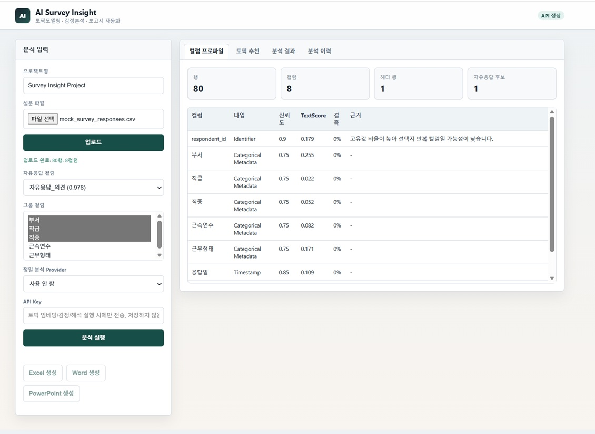
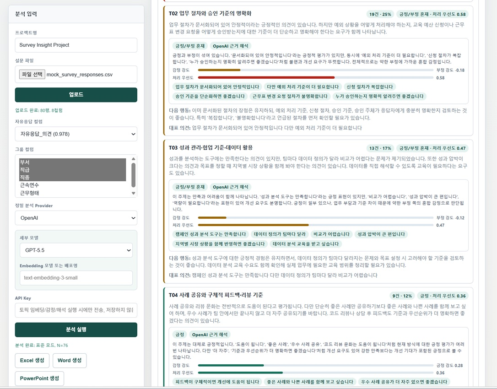
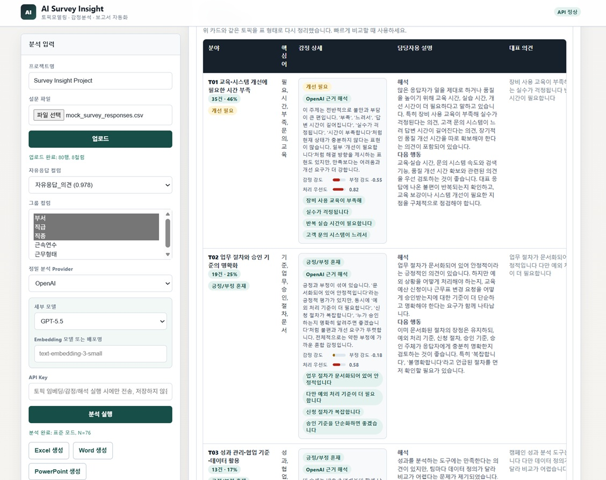
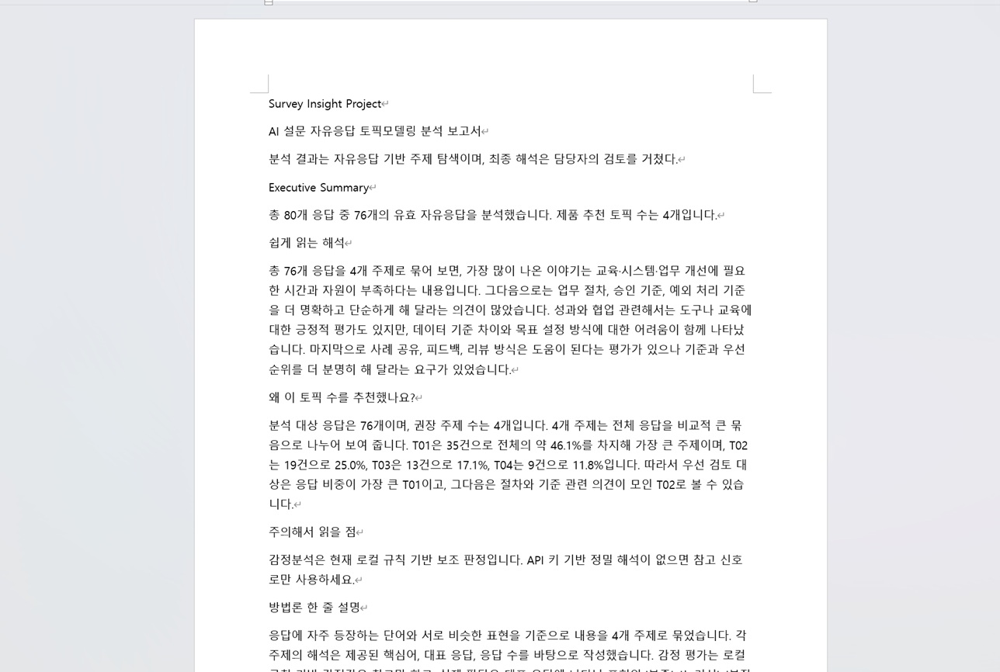

# AI Survey Insight

한국어 설문 자유응답을 업로드하면 컬럼을 자동 점검하고, 토픽모델링과 감정분석을 함께 수행한 뒤 Excel, Word, PowerPoint 보고서로 내보내는 로컬 분석 도구입니다.

분석 결과는 비전공자도 읽을 수 있도록 쉬운 설명, 처리 우선도, 대표 의견, 대응 방향 중심으로 보여줍니다. AI 그림 생성 기능은 제외했으며, 아래 이미지는 실제 대시보드와 보고서 출력 예시입니다.

## 주요 기능

- XLSX/CSV 설문 파일 업로드 및 컬럼 프로파일링
- 자유응답 컬럼 자동 추천, 그룹 컬럼 선택
- Kiwi 기반 한국어 명사 추출, 개인정보 마스킹, 무응답 필터링
- LDA, NMF, KMeans, 계층 군집, DBSCAN/LSA 기반 토픽 후보 비교
- 안정성, 응집도, 분리도, 커버리지 등을 함께 고려한 토픽 수 추천
- 토픽별 감정 방향, 감정 강도, 처리 우선도, 근거 표현 제공
- OpenAI, Gemini, Claude, Azure OpenAI, OpenAI 호환 서버 선택 지원
- OpenAI/Gemini/Claude 세부 모델 선택 및 직접 입력 지원
- Excel, Word, PowerPoint 보고서 생성
- API 키는 분석 요청 중에만 사용하며 저장하지 않음

## 화면 예시

아래 예시는 `sample_data/mock_survey_responses.csv`를 업로드해 분석한 화면입니다. 샘플 데이터는 총 80행이며, 유효 자유응답 76건이 분석되었습니다.

### 1. 컬럼 프로파일



업로드 후 앱은 데이터의 행 수, 컬럼 수, 헤더 위치, 자유응답 후보를 먼저 보여줍니다. 왼쪽 패널에서는 프로젝트명, 설문 파일, 자유응답 컬럼, 그룹 컬럼을 선택합니다. 예시 화면에서는 `자유응답_의견` 컬럼이 자유응답 후보로 추천되었고, 부서/직급/직종/근속연수/근무형태 같은 컬럼을 그룹 비교에 사용할 수 있습니다.

### 2. 토픽 추천 요약


토픽 추천 탭은 담당자가 먼저 읽어야 할 결론을 요약합니다. 예시에서는 표준 모드로 유효 응답 76건을 분석했고, 4개 토픽이 권장되었습니다. 앱은 더 적게 묶는 경우와 더 세분화하는 경우를 비교해 왜 4개가 적절한지 설명합니다. 안정성, 응집도, 분리도, 커버리지 점수도 함께 보여주지만, 설명은 담당자가 이해하기 쉬운 문장으로 제공합니다.

### 3. 우선 확인할 토픽



우선 확인할 토픽 영역은 일부만 잘라서 보여주지 않고, 추천된 모든 토픽을 처리 우선순위대로 정렬해 보여줍니다. 각 카드에는 응답 수와 비율, 감정 방향, 처리 우선도, 감정 근거, 다음 행동, 대표 의견이 함께 표시됩니다. 처리 우선도는 단순히 “급하다”는 뜻이 아니라, 비중과 부정 신호, 개선 요구를 함께 보아 먼저 확인할 필요가 얼마나 큰지를 나타냅니다.

### 4. 전체 토픽 표



전체 토픽 표는 카드 내용을 표 형식으로 다시 정리한 화면입니다. 분야, 핵심어, 감정 상세, 담당자용 설명, 대표 의견을 한 줄에서 비교할 수 있어 회의 자료나 검토 단계에서 빠르게 훑기 좋습니다. 감정 상세에는 감정 강도와 처리 우선도 막대, 근거 표현, 사용한 해석 방식이 포함됩니다.

### 5. Excel 보고서


Excel 내보내기는 분석 결과를 시트별로 나누어 저장합니다. 예시 화면은 `원자료_토픽매칭` 시트로, 각 자유응답이 어떤 토픽에 배정되었는지 확인할 수 있습니다. `redacted_text`에는 개인정보가 마스킹된 응답이 들어가고, `topic_id`, `topic_label`, 부서, 직급, 직종 같은 메타데이터가 함께 표시됩니다. 담당자는 이 시트에서 특정 토픽의 원문 근거를 다시 확인하거나, 부서/직급별로 필터링해 추가 검토할 수 있습니다.

### 6. PowerPoint 보고서


PowerPoint 내보내기는 발표용 요약 자료를 생성합니다. 예시 첫 슬라이드는 프로젝트명, 분석 유형, 표준 모드, 유효 응답 수를 보여줍니다. 이후 슬라이드에는 핵심 발견, 주요 토픽 표, 대표 의견, 주의사항과 방법론이 포함됩니다.

### 7. Word 보고서



Word 보고서는 문서형 검토 자료입니다. Executive Summary, 쉽게 읽는 해석, 토픽 수 추천 이유, 주의해서 읽을 점, 방법론 설명을 포함합니다. 분석 결과가 자동 생성되더라도 최종 해석은 담당자의 검토를 거쳐야 한다는 점을 명시합니다.

## 프로젝트 구조

```text
survey_insight/
  api.py                 FastAPI 라우트와 웹 진입점
  ui.py                  브라우저 UI
  pipeline.py            분석 파이프라인
  preprocessing.py       한국어 전처리, Kiwi 토큰화, PII 마스킹
  topics.py              토픽 후보 생성 및 평가
  embeddings.py          선택 provider 임베딩 호출
  sentiment.py           로컬 감정/처리 우선도 보조 분석
  llm_interpretation.py  선택 provider 기반 근거 해석
  exports.py             Excel, Word, PowerPoint 출력
  storage.py             SQLite 저장소
sample_data/             테스트용 모의 데이터
docs/images/             README 화면 예시 이미지
tests/                   unittest 테스트
out*/                    로컬 생성 결과물
```

## 설치

Python 3.11 이상을 권장합니다.

```powershell
python -m pip install -r requirements.txt
```

`kiwipiepy`가 설치되어 있으면 한국어 명사 추출에 Kiwi를 사용합니다. 사용할 수 없는 환경에서는 투명하게 fallback 키워드 추출을 사용하고, 분석 결과에 해당 사실을 기록합니다.

## 실행

Windows에서는 배치 파일을 실행하는 방식이 가장 간단합니다.

```text
start_app.bat
```

직접 실행하려면 다음 명령을 사용합니다.

```powershell
python -m uvicorn survey_insight.api:app --host 127.0.0.1 --port 8001
```

브라우저에서 `http://127.0.0.1:8001`을 엽니다. 8001 포트가 사용 중이면 다른 포트를 지정해 실행하세요.

## 샘플 데이터

웹 화면에서 `sample_data/mock_survey_responses.csv`를 업로드하면 전체 흐름을 테스트할 수 있습니다.

CLI 데모를 실행하려면 다음 명령을 사용합니다.

```powershell
python -m survey_insight.cli demo --out .\out
```

생성 결과:

- `out\demo_survey.xlsx`
- `out\analysis_package.json`
- `out\survey_insight_report.xlsx`
- `out\survey_insight_report.docx`
- `out\survey_insight_report.pptx`

## Provider 및 모델 선택

화면에서 Provider를 고르면 해당 Provider의 세부 모델을 선택할 수 있습니다. 목록에 없는 모델은 직접 입력으로 사용할 수 있습니다.

- OpenAI: `gpt-5.5`, `gpt-5.4`, `gpt-5.4-mini`, 직접 입력
- Gemini: `gemini-3.5-flash`, `gemini-3.1-pro-preview`, `gemini-3.1-flash`, `gemini-3.1-flash-lite`, 직접 입력
- Claude: `claude-sonnet-5`, `claude-opus-4-8`, `claude-sonnet-4-6`, `claude-haiku-4-5-20251001`, 직접 입력
- Azure OpenAI: Azure endpoint, chat deployment, embedding deployment 직접 입력
- OpenAI 호환 서버: base URL과 모델명 직접 입력

API 키와 endpoint는 분석 요청 중에만 메모리에서 사용하며 SQLite나 보고서에 저장하지 않습니다. 테스트용 또는 예시처럼 보이는 키는 외부 호출을 건너뛰고 로컬 분석으로 대체합니다.

## 테스트

```powershell
python -m unittest discover -s tests -v
```

테스트는 API 흐름, 저장소 round-trip, 한국어 토큰화, 토픽 후보 생성, provider embedding/LLM mock 경로, export 개인정보 보호, UI 렌더링을 확인합니다.

## API 개요

- `POST /datasets/upload?filename=survey.xlsx`
- `GET /datasets/{dataset_id}/profile`
- `POST /model-runs`
- `GET /model-runs/{run_id}/recommendation`
- `POST /model-runs/{run_id}/edits`
- `POST /exports`
- `GET /exports/{run_id}/{excel|word|powerpoint}/download`
- `GET /projects/recent`

`POST /datasets/upload`는 요청 본문에 파일 bytes를 그대로 받습니다.

## 개인정보 및 보안

분석 전 개인정보 마스킹을 수행합니다. 외부 provider를 사용할 때도 원문 전체가 아니라 마스킹된 텍스트와 대표 응답 중심으로 전송합니다. Excel export는 기본적으로 `redacted_text`를 사용하며 `original_text`를 포함하지 않습니다.

`out/`, `out_debug/`, `out_validation/`, `out_precision_validation/`, `out/app.db`는 로컬 생성물입니다. 실제 설문 데이터가 포함될 수 있으므로 공유 전 내용을 확인하세요.
