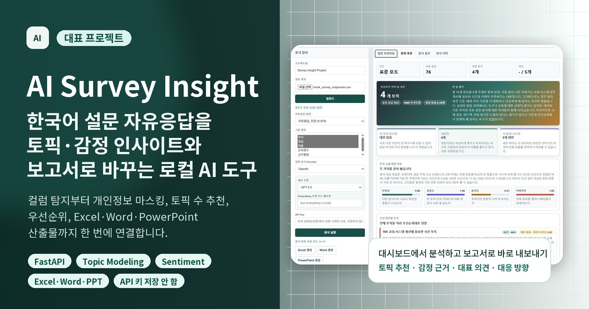
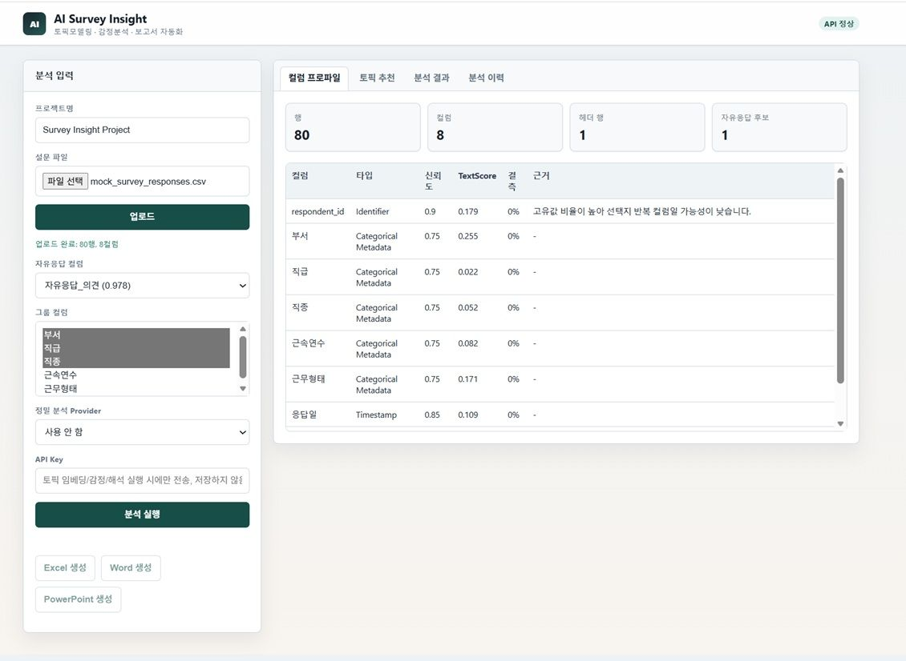
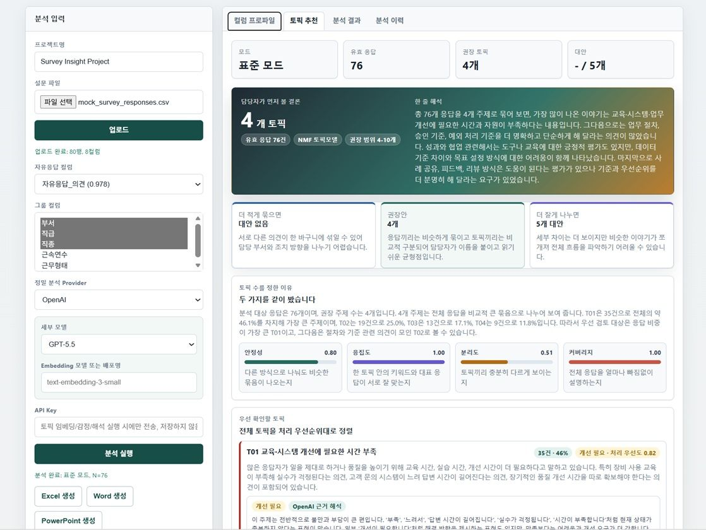
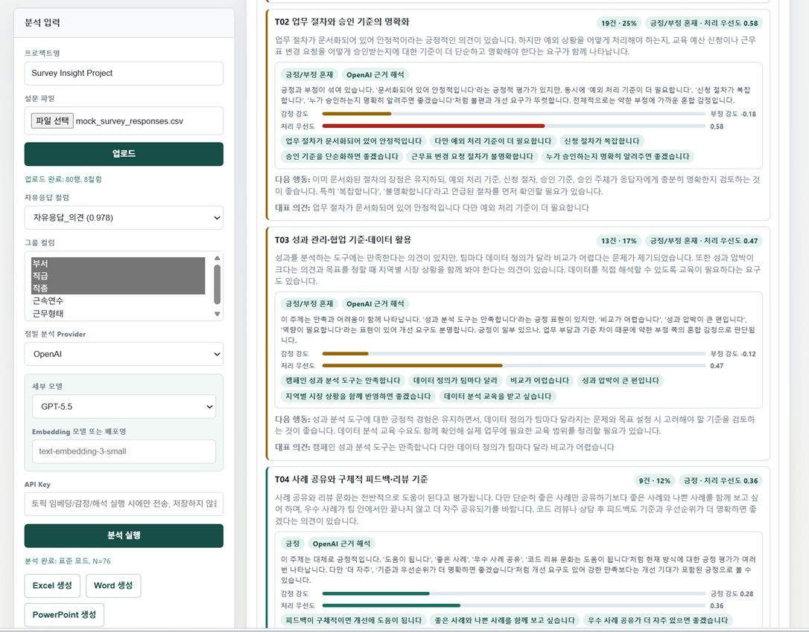
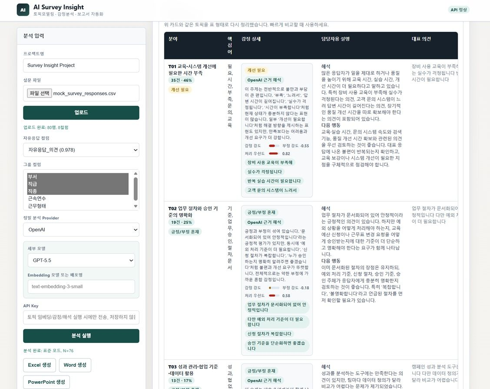
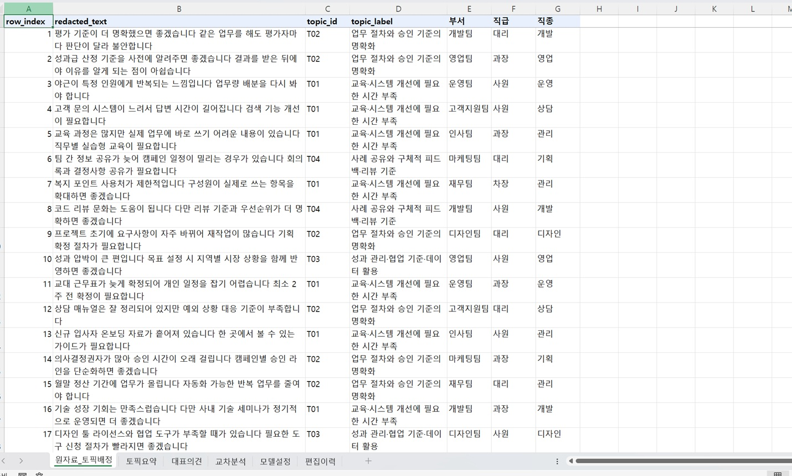
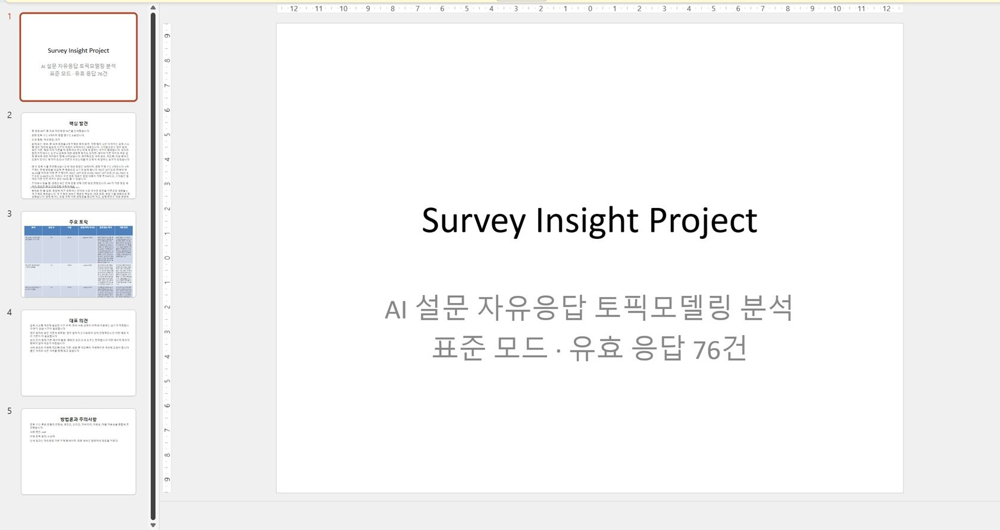

# AI Survey Insight

[](https://www.python.org/)
[](https://github.com/koul777/AI-Survey-Insight/actions/workflows/test.yml)
[](LICENSE)

<p align="center">
  
</p>

한국어 설문 자유응답을 로컬에서 프로파일링·마스킹·토픽 분석하고 Excel, Word, PowerPoint 검토 자료로 만드는 FastAPI 도구입니다.

## 해결하려는 문제

설문 자유응답은 양이 늘수록 사람이 일관된 기준으로 분류하고 대표 의견을 찾기 어렵습니다. AI Survey Insight는 자유응답 컬럼 탐지부터 전처리, 여러 토픽 후보 비교, 감정 신호, 그룹 비교, 보고서 생성까지 한 흐름으로 묶습니다. 결과는 자동 의사결정이 아니라 담당자가 원문과 함께 검토할 **탐색적 분석 후보**입니다.

## 핵심 특징

- CSV/XLSX 업로드, 헤더 탐지, 자유응답·그룹 컬럼 추천
- Kiwi 명사 추출과 명시적 fallback, 무응답 제외
- 이메일·국내 이동전화 번호·사번/직번 패턴 마스킹
- KMeans, 계층 군집, NMF, LDA, DBSCAN/LSA 후보 비교
- NMF에는 TF-IDF, LDA에는 정수 단어 빈도를 사용하고 잠재 성분의 키워드·문서 가중치를 보존
- 최소 토픽 크기와 70% 분석 포함률 구조 관문 후 휴리스틱 복합 평가
- 같은 입력·같은 seed의 로컬 결과 재현성 검사
- 규칙·어휘 기반 감정 신호와 검토 우선도 보조값
- 선택적 AI provider 임베딩·근거 해석 보강 및 실패 시 로컬 fallback
- Excel, Word, PowerPoint 보고서와 사용자 수정 이력

## 실제 사용 화면

아래 이미지는 `sample_data/mock_survey_responses.csv`를 분석한 예시입니다. 화면에 표시되는 권장 토픽 수와 점수는 코드·라이브러리 버전에 따라 바뀔 수 있습니다.

<table>
  <tr>
    <td width="50%"><br /><strong>컬럼 프로파일</strong><br />행·컬럼 수와 자유응답 후보를 확인합니다.</td>
    <td width="50%"><br /><strong>토픽 권장안</strong><br />권장 토픽 수, 대안, 구조 관문과 휴리스틱 점수를 검토합니다.</td>
  </tr>
  <tr>
    <td width="50%"><br /><strong>먼저 검토할 토픽</strong><br />비중·부정 표현·검토 우선도 신호를 함께 봅니다.</td>
    <td width="50%"><br /><strong>전체 토픽</strong><br />키워드, 대표 의견, 감정 근거와 담당자 설명을 비교합니다.</td>
  </tr>
</table>

## 빠른 시작

Python 3.11 이상이 필요합니다.

```powershell
python -m pip install -e .
python -m uvicorn survey_insight.api:app --host 127.0.0.1 --port 8001
```

브라우저에서 `http://127.0.0.1:8001`을 엽니다. 기존 설치 방식도 지원합니다.

```powershell
python -m pip install -r requirements.txt
```

Windows에서는 `start_app.bat` 또는 `start_app.ps1`로 실행할 수 있습니다. 샘플 파일은 `sample_data/mock_survey_responses.csv`입니다.

소스 수정이나 테스트 실행이 목적이라면 FastAPI 테스트 클라이언트용 선택 의존성까지 설치합니다. 일반 실행에는 이 추가 설치가 필요하지 않습니다.

```powershell
python -m pip install -e ".[test]"
```

## 분석 흐름

1. CSV/XLSX를 업로드하고 추천된 자유응답 컬럼을 확인합니다.
2. 선택한 그룹 컬럼과 원문을 로컬 SQLite에 저장합니다.
3. 무응답을 제외하고 일부 식별정보 패턴을 마스킹합니다.
4. 표본 크기에 맞는 토픽 수 범위에서 로컬 후보를 생성합니다.
5. 구조 관문을 통과한 후보를 여섯 구성 지표와 감점으로 비교합니다.
6. 권장안·더 넓은 대안·더 세분화한 대안의 대표 응답을 사람이 검토합니다.
7. 필요할 때만 외부 AI 보강을 요청하고, 최종 라벨과 해석을 수정합니다.
8. 보고서를 생성하고 배포 전 개인정보·소그룹·표현을 재검토합니다.

## 보고서 산출물

<table>
  <tr>
    <td width="33%"><br /><strong>Excel</strong><br />토픽 요약, 마스킹 텍스트 배정, 그룹 비교, 모델 설정</td>
    <td width="33%"><br /><strong>Word</strong><br />요약, 토픽, 지표, 방법론과 주의사항</td>
    <td width="33%"><br /><strong>PowerPoint</strong><br />발표용 요약, 핵심 토픽과 대표 의견</td>
  </tr>
</table>

CLI 데모는 고정 fixture와 세 보고서를 만듭니다.

```powershell
python -m survey_insight.cli demo --out .\out --seed 42
```

실제 파일은 다음과 같이 분석합니다.

```powershell
python -m survey_insight.cli analyze --input .\sample_data\mock_survey_responses.csv --out .\out --seed 42
```

`out/` 아래에는 원문이 포함된 `analysis_package.json`, 데모 원본, 보고서가 생성될 수 있습니다. Git에 추가하거나 검토 없이 공유하지 마세요.

## 로컬 분석과 선택적 AI 보강

| 구분 | 로컬 기본 분석 | 외부 AI 보강 |
|---|---|---|
| 토픽 후보 | TF-IDF/빈도 기반 KMeans·NMF·LDA·계층·DBSCAN | provider embedding 후보 추가 가능 |
| 감정 | 규칙·어휘 기반 신호 | 대표 텍스트 근거 해석 보강 |
| 네트워크 | 외부 서버로 자동 전송하지 않음 | 선택한 provider로 마스킹 텍스트 또는 대표 응답이 전송될 수 있음 |
| 실패 | 로컬 결과 제공 | 안전한 경고 후 로컬 결과 유지 |

지원 UI는 OpenAI, Gemini, Claude, Azure OpenAI, OpenAI-compatible provider를 선택할 수 있습니다. 화면의 모델 preset은 편의를 위한 **예시**이며 provider의 현재 제공 여부를 보장하지 않습니다. 직접 모델명 또는 deployment 이름을 입력할 수 있습니다. Claude 선택 시 별도 embedding 후보 없이 로컬 토픽 모델을 사용하고, 채팅 해석만 시도합니다.

API 키는 분석 요청 처리 중에만 사용하며 SQLite, 분석 package JSON, 보고서에 저장하지 않습니다. 예시·placeholder 키는 외부 호출을 건너뜁니다. UI와 API는 실제 키를 사용하는 외부 분석 전에 전송 안내 확인을 요구합니다. 외부 호출 오류의 원문 본문이나 credential을 사용자 화면에 그대로 표시하지 않는 것을 설계 원칙으로 합니다.

## 개인정보·데이터 저장 정책

“로컬 실행”은 “아무것도 저장하지 않음”과 다릅니다.

- 기본 SQLite 경로는 `out/app.db`이며 `SURVEY_INSIGHT_DB_PATH`로 바꿀 수 있습니다.
- 업로드 원본 bytes, 파일 메타데이터·컬럼 프로파일, 분석 package가 SQLite에 저장됩니다. 분석 package에는 원문과 마스킹 텍스트가 모두 포함될 수 있습니다.
- 보고서와 CLI 산출물은 사용자가 지정한 `out*/` 경로에 생성됩니다.
- 분석 이력의 **분석 결과 삭제**는 run과 서버 export를 지우고, **원본·연결 분석 삭제**는 업로드 원본과 연결 run·서버 export를 함께 지웁니다. 이미 내려받거나 복사한 파일은 별도로 삭제해야 합니다.
- 외부 provider를 선택하지 않으면 설문 텍스트를 외부 서버로 자동 전송하지 않습니다.
- 외부 provider를 선택하면 마스킹된 자유응답 또는 대표 응답이 해당 provider로 전송될 수 있습니다. 조직의 위탁처리·국외 이전·보존 정책을 먼저 확인하세요.

이메일, 휴대전화 번호, 사번 등 일부 식별정보 패턴을 마스킹합니다. `성명:`, `주소:`, 주민등록번호·계좌번호 문맥은 자동 익명화를 주장하지 않고 `privacy_review_flags`로 표시합니다. 모든 개인정보를 완벽하게 탐지하거나 익명화하는 기능은 아니므로, 실제 보고서 배포 전 담당자의 검토가 필요합니다. 그룹 비교의 5건 미만 표시 억제도 완전한 재식별 방지를 보장하지 않습니다.

현재 버전에서 데이터를 지우는 방법과 API는 [SECURITY.md](SECURITY.md)에 정리합니다. DB 파일을 직접 삭제할 때는 앱을 종료하고 정확한 `SURVEY_INSIGHT_DB_PATH`와 `out*/` 보고서 경로를 확인하세요.

프로세스 종료 시 자동 소멸하는 `ephemeral` 저장 모드는 아직 구현하지 않았습니다. 민감한 운영 환경에서는 격리된 작업 디렉터리·암호화된 디스크·최소 보존기간을 적용하고 분석 후 UI 삭제와 별도 복사본 삭제를 수행하세요.

## 분석 방법론과 한계

권장 토픽 수는 “통계적 최적값”이 아닙니다. 최소 토픽 크기·분석 포함률 구조 관문을 통과한 후보에서 다음 지표를 결합한 제품용 휴리스틱입니다.

- `stability` → **군집 품질 종합점수**: 하위 호환 필드이며 반복 표본의 통계적 안정성이 아님
- `coherence` → **토픽 해석 가능성 점수**: 상위 키워드의 문서 동시출현을 이용한 bounded UMass-style 값
- `semantic_quality` → **군집 분리도**: 노이즈 제외 cosine silhouette
- `coverage` → **분석 포함률**
- `diversity` → **토픽 키워드 다양성**
- `labelability` → **라벨 해석 가능성**
- `balance` → **토픽 크기 균형**
- `weight_acceptability` → **가중치 시나리오 선정률**: 기본 가중치를 각각 50–150% 범위에서 바꾼 512개 시나리오의 선정 비율이며 정확도 확률이 아님
- `bootstrap_gate_pass_rate` → **Bootstrap 구조 관문 통과율**: 현재 배정에 조건부인 500회 복원추출 진단이며 통계적 검정력이 아님
- `resampling_stability` → **부분표본 일치도**: 선정 후보의 5회 80% 층화 부분표본 재적합 ARI 진단이며 권장 점수에는 미포함

기본 복합 가중치는 외부 정답으로 학습된 값이 아닙니다. 거의 동점인 후보에서는 제한 범위 가중치 시나리오 선정률을 먼저 보고, 같으면 더 단순한 토픽 수를 선택합니다. NMF/LDA는 모델 성분에서 키워드를 뽑고 문서–토픽 가중치로 대표 응답을 정합니다. KMeans·계층·DBSCAN은 군집 중심에 가까운 응답을 사용합니다. 점수는 같은 코퍼스의 후보를 비교하는 용도이며 서로 다른 조사 사이의 정확도 비교에 사용할 수 없습니다.

명시적 귀무가설·효과크기·정답 토픽·사전 표본설계가 없으므로 고전적 의미의 통계적 검정력이나 p-value를 제공하지 않습니다. bootstrap과 부분표본 일치도는 표본 및 모델 선택 민감도를 드러내는 진단이며, 담당자의 토픽 라벨·대표 응답 검토를 대체하지 않습니다.

감정 결과는 규칙·어휘 기반 **감정 신호 분석**이고 심리 진단이나 임상적 판단이 아닙니다. 처리 우선도는 긴급성·위험도를 판정하지 않고 먼저 검토할 표현을 정렬하는 보조지표입니다.

분석 후 UI 또는 `record_review` edit API로 검토자·판정·메모를 기록할 수 있습니다. 승인 이후 토픽 구조를 변경하면 승인 상태가 자동으로 재검토 필요 상태로 바뀝니다. 정답 라벨 CSV가 있는 경우 `survey-insight evaluate-sentiment`로 원문이 없는 집계 평가 JSON을 만들 수 있습니다.

계산식, 후보별 입력 공간, 소표본 정책과 알려진 한계는 [분석 방법론](docs/METHODOLOGY.md), 재현 가능한 점검 절차는 [기능 검증 및 결과 점검](docs/EVALUATION.md)을 확인하세요. 실제 운영 전에는 [책임 있는 AI 운영 점검표](docs/RESPONSIBLE_AI_CHECKLIST.md)를 적용하고, 판정 추적 방식은 [재현 가능한 예시](docs/TRACEABLE_EXAMPLES.md)를 참고하세요.

## 테스트

먼저 테스트용 선택 의존성을 설치한 뒤 외부 API 호출 없이 전체 테스트를 실행합니다.

```powershell
python -m pip install -e ".[test]"
python -m unittest discover -s tests -v
python -m compileall survey_insight tests
```

GitHub Actions도 같은 테스트 선택 의존성을 설치하고 Python 3.11·3.12에서 위 검사를 실행합니다. `SURVEY_INSIGHT_DISABLE_NETWORK=1`을 설정하며 provider 테스트는 mock을 사용하므로 실제 API 키나 외부 AI 호출에 의존하지 않습니다.

테스트는 API·SQLite round trip, 전처리, 토픽 후보와 구조 관문, 동일 seed 재현성, provider mock/fallback, API 키 비저장, export 개인정보 보호와 OOXML 구조, UI 핵심 문구를 확인합니다. 이는 기능 동작 점검이며 분석 정확도나 통계적 타당성을 보증하지 않습니다. 실제 실행 결과는 릴리스나 PR에서 명령·통과 수와 함께 기록해야 합니다.

## 프로젝트 구조

```text
survey_insight/
  api.py                 FastAPI 라우트와 웹 진입점
  ui.py                  브라우저 UI
  pipeline.py            분석 파이프라인과 그룹 비교
  preprocessing.py       한국어 전처리·일부 PII 패턴 마스킹
  topics.py              토픽 후보·구조 관문·휴리스틱 평가
  embeddings.py          선택 provider 임베딩
  sentiment.py           규칙·어휘 기반 감정 신호
  evaluation.py          사용자 제공 감정 정답셋 집계 평가
  llm_interpretation.py  선택 provider 근거 해석
  exports.py             Excel·Word·PowerPoint 출력
  storage.py             로컬 SQLite 저장소
docs/                    방법론·평가·책임 있는 AI 점검·추적 예시와 화면 이미지
sample_data/             합성·모의 데이터
tests/                   unittest 테스트
out*/                    로컬 DB·생성 보고서(소스 아님)
```

주요 API는 `POST /datasets/upload`, `GET /datasets/{dataset_id}/profile`, `DELETE /datasets/{dataset_id}?delete_runs=true`, `POST /model-runs`, `GET /model-runs/{run_id}/recommendation`, `DELETE /model-runs/{run_id}`, `POST /model-runs/{run_id}/edits`, `POST /exports`, `GET /projects/recent`입니다. 업로드 API는 파일 bytes를 요청 본문으로 받습니다. 연결 run이 있는 dataset은 기본 삭제를 거부하며, 함께 삭제하려면 `delete_runs=true`를 명시해야 합니다.

## 라이선스

소스 코드는 [MIT License](LICENSE)로 배포합니다. 외부 라이브러리와 사용자가 선택한 AI provider에는 각각의 라이선스·약관이 적용됩니다.

## 면책 및 책임 있는 사용

이 프로젝트는 HR 의사결정을 자동화하거나 법률·노무·보안 자문을 제공하지 않습니다. 채용, 평가, 보상, 징계, 구조조정 등 개인에게 중대한 영향을 주는 결정의 단독 근거로 사용하지 마세요. 토픽 라벨, 대표 의견, 감정 신호, 그룹 차이는 편향·표본 크기·문맥 손실의 영향을 받으므로 원자료와 조직 맥락을 아는 사람이 검토하고 이의를 제기하거나 수정할 절차를 마련해야 합니다.
